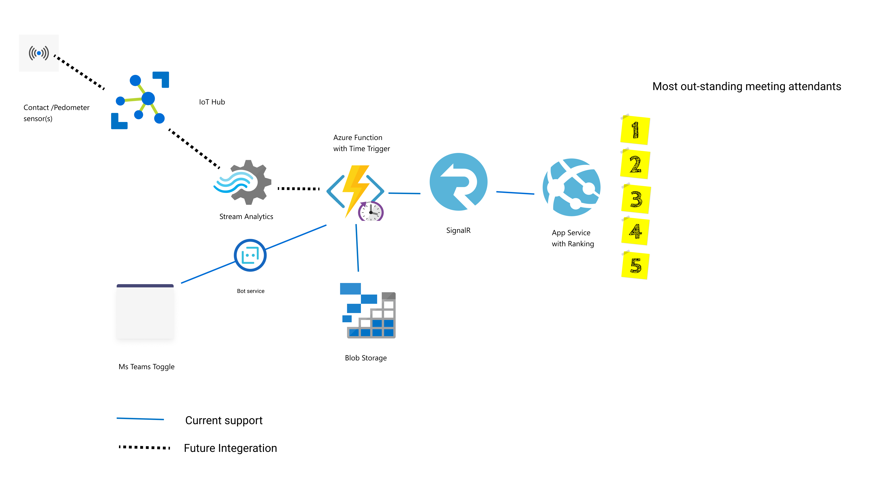

# Outstanding Meetings #
We put together outstanding meetings after having discussions about how the standing piece of daily standup meetings is going away with virtual meetings. Outstanding meetings provides incentive for meeting attendants to stand up during meetings. A leader board of most *__outstanding__* meeting attendants together with daily status ranking provides a gamified approach to practicing healthy habits at work and reduce increased risk of health related complications [[1]](#1).

> This project is created as part of [Microsoft US Hack for Wellness 2021](https://wellnesshack.devpost.com/)

## Technology Used ##
- App Service
- Azure Function
- Blob Storage
- Microsoft Teams Bot

## Architecture ##

## Design Rationale ##
On-demand data processing with Azure Function, coupled with web socket communication with SignalR provides the solution scalability it needs to support high volume of data. 

## Current Feature ##
The solution supports displaying the ranking of most *__outstanding__* meeting attendants Microsoft Teams. Individual meeting participants will record the time they stood up/sat down during a Microsoft Teams meetings.

## Future Development ##
Contact sensors attached to standing tables and wearable pedometer sensor will be integrated for the future state of the solution to gather more accurate health metrics such as time spent standing during virtual meetings and time it takes to walk to a physical meeting room.

## Accessibility ##
Future integration of sensors will make the solution more accessible by providing alternate ways to stay active during meetings for individuals with limited mobility.

## Project Structure ##
- Folder `.github` yaml templates and scripts to deploy App Service and Azure Function.
- Folder `app-service` Azure App Service
- Folder `bot` Microsoft Teams integrated Bot
- Folder `function` Azure Function

## Contributors ##
- Rupesh Kurvankattil 
- Steve Jones
- Tariku Tessema

## References
<a id="1">[1]</a> 
Biswas A, Oh PI, Faulkner GE, et al. Sedentary time and its association with risk for disease incidence, mortality, and hospitalization in adults: a systematic review and meta-analysis [published correction appears in Ann Intern Med. 2015 Sep 1;163(5):400]. Ann Intern Med. 2015;162(2):123-132. doi:10.7326/M14-1651