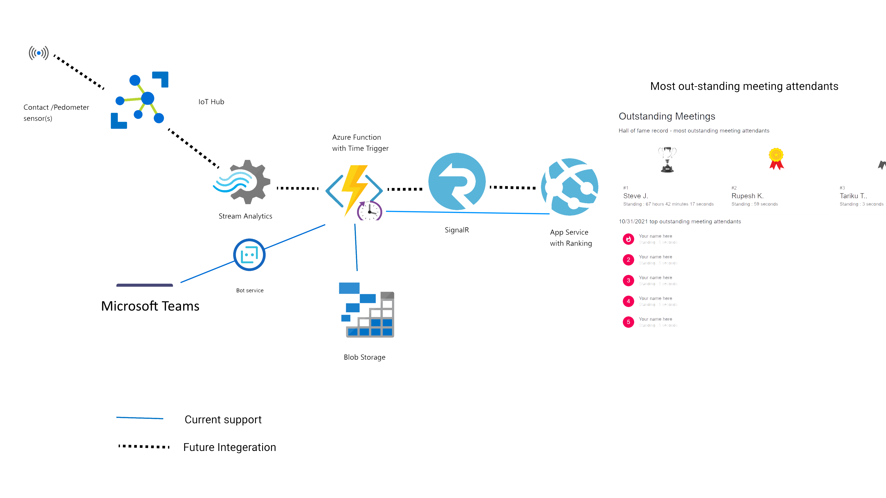

# Out-standing Meetings #
 A recent study indicates that prolonged sedentary time such as sitting contributes to increased risk of myriad of health related complications [[1]](#1). Out-standing meetings, a Microsoft Teams bot, helps individuals be non-sedentary during meetings by providing incentive to physically stand up. Working with Azure service offerings, the bot keeps track of the duration that meeting attendants are physically standing-up during meetings to create a ranking for most active out-standing meeting attendants.

> This project is created as part of [Microsoft US Hack for Wellness 2021](https://wellnesshack.devpost.com/)

## Technology Used ##
- App Service
- Azure Function
- Blob Storage
- Microsoft Teams Bot

## Architecture ##

## Design Rationale ##
On-demand elastic data processing with Azure Function, coupled with web socket communication with SignalR provides the solution scalability it needs to support high volume of data. 

## Current Feature ##
The solution supports displaying the rank of most out-standing meeting attendants Microsoft Teams. Individual meeting participants will record the time they stood up/sit down during Microsoft Teams meetings.

## Future Development ##
Contact sensors to standing tables and wearable pedometer sensor will be integrated for the future state of the solution to gather more accurate health data such as walking to meeting rooms and the time spent standing during meetings.

## Accessibility ##
Future integration of sensors will make the solution more accessible by providing alternate ways to stay active during meetings for individuals with limited mobility.

## Project Structure ##
- Folder `.github` yaml templates and scripts to deploy resources to Azure
- Folder `app-service` Azure App Service
- Folder `bot` Microsoft Teams integrated Bot
- Folder `function` Azure Function

## Contributors ##
- Rupesh Kurvankattil 
- Steve Jones
- Tariku Tessema

## References
<a id="1">[1]</a> 
Biswas A, Oh PI, Faulkner GE, et al. Sedentary time and its association with risk for disease incidence, mortality, and hospitalization in adults: a systematic review and meta-analysis [published correction appears in Ann Intern Med. 2015 Sep 1;163(5):400]. Ann Intern Med. 2015;162(2):123-132. doi:10.7326/M14-1651